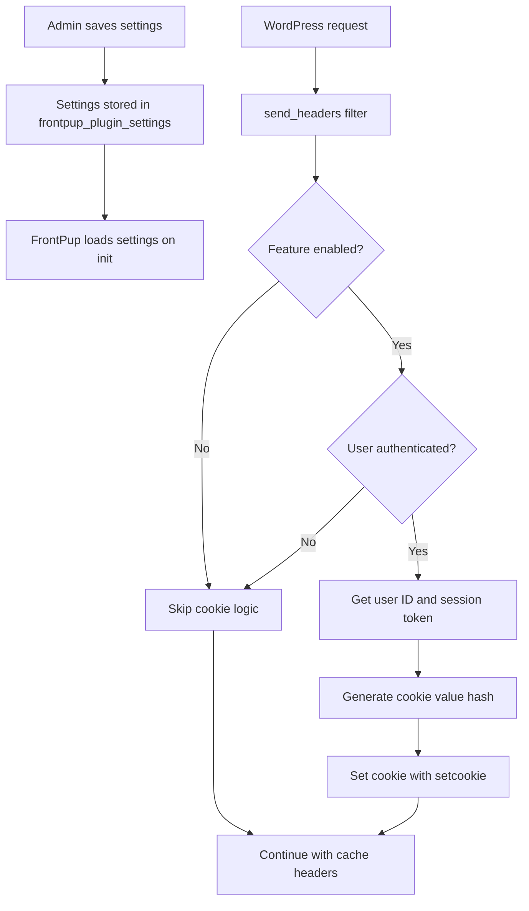

# Design Document: Cache Unique Visitors

## Overview

The Cache Unique Visitors feature enables CloudFront to cache different versions of pages for authenticated vs. anonymous users by setting a unique cookie when a WordPress user is signed in. This allows CloudFront cache policies to differentiate between user types, improving cache hit rates while maintaining personalized content delivery.

### Goals

- Enable administrators to toggle the unique visitor cookie feature on/off
- Allow configuration of a custom cookie name to match CloudFront cache policy settings
- Set a deterministic, unique cookie value for each authenticated user session
- Integrate seamlessly with existing FrontPup cache control logic without disruption
- Follow WordPress and FrontPup coding conventions

### Non-Goals

- Automatic CloudFront cache policy configuration (administrators must configure CloudFront separately)
- Cookie-based user tracking or analytics
- Support for multiple cookie names or complex cookie strategies
- Modification of existing cache control header logic

## Architecture

### High-Level Design

The feature consists of three main components:

1. **Settings Management** (`FrontPup_Admin_Cache_Control`)
   - Extends existing Cache Settings page with two new fields
   - Stores settings in existing `frontpup_plugin_settings` option
   - Validates and sanitizes user input

2. **Cookie Handler** (`FrontPup` class)
   - Executes during the `send_headers` filter (existing hook)
   - Checks if feature is enabled and user is authenticated
   - Sets cookie with appropriate attributes before headers are sent

3. **Cookie Value Generator** (utility method in `FrontPup` class)
   - Creates deterministic unique identifier per user session
   - Uses WordPress user ID and session token as inputs
   - Produces consistent value for same user session

### Integration Points

```
WordPress Request Lifecycle
    ↓
send_headers filter (priority 10)
    ↓
FrontPup::send_headers()
    ├─→ Check if unique visitor feature enabled
    ├─→ Check if user authenticated (LOGGED_IN_COOKIE)
    ├─→ Generate cookie value (user_id + session_token)
    ├─→ Set cookie with setcookie()
    └─→ Continue with existing cache header logic
```

### Data Flow



## Components and Interfaces

### 1. Settings Management

**Class**: `FrontPup_Admin_Cache_Control` (extends `FrontPup_Admin_Base`)

**New Properties**:
```php
protected $settings_defaults = [
    // ... existing defaults ...
    'cache_unique_visitors_enabled' => 0,
    'cache_unique_visitors_cookie_name' => 'cf_cache',
];

protected $booleanFields = [
    // ... existing fields ...
    'cache_unique_visitors_enabled'
];

protected $stringFields = [
    // ... existing fields ...
    'cache_unique_visitors_cookie_name'
];
```

**Modified Methods**:
- `sanitize_settings()`: Inherited from base class, will automatically handle new fields
- Custom sanitization for cookie name: override to add pattern validation

**New Method**:
```php
/**
 * Sanitize cookie name to allow only alphanumeric, underscore, hyphen
 * 
 * @param string $name Cookie name input
 * @return string Sanitized cookie name
 */
private function sanitize_cookie_name( string $name ): string
```

### 2. View Template

**File**: `admin/views/cache-control-settings.php`

**New HTML Section** (to be added after existing cache control settings):
```html
<h2>Cache Unique Visitors</h2>
<table class="form-table">
  <tr>
    <th>Enable Cache Unique Visitors</th>
    <td>
      <input type="checkbox" name="frontpup_plugin_settings[cache_unique_visitors_enabled]" value="1" />
      <p class="description">Set a unique cookie for authenticated users to enable CloudFront cache differentiation.</p>
    </td>
  </tr>
  <tr id="cache-unique-visitors-cookie-name-row">
    <th>Cookie Name</th>
    <td>
      <input type="text" name="frontpup_plugin_settings[cache_unique_visitors_cookie_name]" class="regular-text" />
      <p class="description">
        Cookie name to use (default: cf_cache). Must match your CloudFront cache policy configuration.
        <br><strong>Important:</strong> You must configure your CloudFront cache policy to include this cookie name in the cache key.
      </p>
    </td>
  </tr>
</table>
```

**JavaScript** (inline in view):
- Show/hide cookie name field based on toggle state
- Follow existing pattern from `custom_smaxage_enabled` checkbox

### 3. Cookie Handler

**Class**: `FrontPup`

**New Method**:
```php
/**
 * Set unique visitor cookie for authenticated users
 * Called during send_headers filter before cache headers are set
 * 
 * @return void
 */
private function set_unique_visitor_cookie(): void
```

**Modified Method**:
```php
/**
 * send_headers filter
 * Add cookie setting logic before existing cache header logic
 */
public function send_headers()
```

**Implementation Logic**:
1. Check if `cache_unique_visitors_enabled` setting is truthy
2. Check if `LOGGED_IN_COOKIE` is set (user authenticated)
3. Check if headers already sent (safety check)
4. Get cookie name from settings (default: 'cf_cache')
5. Check if cookie already exists with same value (avoid redundant setcookie calls)
6. Generate cookie value using `generate_unique_visitor_value()`
7. Call `setcookie()` with appropriate parameters
8. Continue with existing cache header logic

### 4. Cookie Value Generator

**New Method**:
```php
/**
 * Generate unique visitor cookie value
 * Creates a deterministic hash based on user ID and session token
 * 
 * @return string Cookie value (32-character hex string)
 */
private function generate_unique_visitor_value(): string
```

**Algorithm**:
```php
$user_id = get_current_user_id();
$session_token = wp_get_session_token();

// Combine user ID and session token
$data = $user_id . '|' . $session_token;

// Generate hash (md5 is sufficient for cache differentiation, not security)
$hash = md5( $data );

return $hash;
```

**Rationale**:
- **User ID**: Ensures different users get different cookie values
- **Session token**: Ensures value changes when user logs out and back in
- **MD5 hash**: Sufficient for cache key differentiation (not used for security)
- **Deterministic**: Same user session always produces same value
- **No PII**: Hash obscures user ID from plain text

## Data Models

### Settings Schema

**WordPress Option**: `frontpup_plugin_settings`

**New Fields**:
```php
[
    // ... existing fields ...
    'cache_unique_visitors_enabled' => (int) 0|1,
    'cache_unique_visitors_cookie_name' => (string) 'cf_cache',
]
```

### Cookie Attributes

**Cookie Name**: Configurable (default: `cf_cache`)

**Cookie Value**: 32-character hexadecimal string (MD5 hash)

**Cookie Attributes**:
- **Path**: `/` (site-wide)
- **Expires**: `0` (session cookie, expires when browser closes)
- **Secure**: `true` if `is_ssl()` returns true
- **HttpOnly**: `true` (prevent JavaScript access)
- **SameSite**: `Lax` (balance security and functionality)

**Example**:
```
Set-Cookie: cf_cache=5d41402abc4b2a76b9719d911017c592; Path=/; Secure; HttpOnly; SameSite=Lax
```

## Correctness Properties

*A property is a characteristic or behavior that should hold true across all valid executions of a system—essentially, a formal statement about what the system should do. Properties serve as the bridge between human-readable specifications and machine-verifiable correctness guarantees.*


### Property 1: Cookie Name Sanitization

*For any* input string provided as a cookie name, the sanitized output SHALL contain only alphanumeric characters (a-z, A-Z, 0-9), underscores (_), and hyphens (-).

**Validates: Requirements 2.4, 8.1, 8.2**

### Property 2: Feature Disabled Prevents Cookie

*For any* request state, when the `cache_unique_visitors_enabled` setting is disabled (0 or falsy), the Cookie_Handler SHALL NOT set the unique visitor cookie.

**Validates: Requirements 1.2**

### Property 3: Authenticated User Gets Cookie When Enabled

*For any* authenticated user (with `LOGGED_IN_COOKIE` set), when the `cache_unique_visitors_enabled` setting is enabled (1 or truthy), the Cookie_Handler SHALL set the unique visitor cookie.

**Validates: Requirements 1.3, 4.1**

### Property 4: Unauthenticated User Never Gets Cookie

*For any* request where the user is not authenticated (no `LOGGED_IN_COOKIE`), the Cookie_Handler SHALL NOT set the unique visitor cookie, regardless of the feature enabled state.

**Validates: Requirements 4.2**

### Property 5: Cookie Value Determinism

*For any* user ID and session token combination, calling the `generate_unique_visitor_value()` method multiple times with the same inputs SHALL produce the same cookie value output.

**Validates: Requirements 4.5, 6.2, 6.4**

### Property 6: Cookie Value Uniqueness Across Sessions

*For any* two different user sessions (different user ID or different session token), the generated cookie values SHALL be different.

**Validates: Requirements 4.3, 6.1, 6.3**

### Property 7: Cookie Value Does Not Contain PII

*For any* user ID, the generated cookie value SHALL NOT contain the user ID as a plain text substring.

**Validates: Requirements 6.5**

### Property 8: Custom Cookie Name Usage

*For any* valid cookie name provided in the `cache_unique_visitors_cookie_name` setting, the Cookie_Handler SHALL use that exact name when calling `setcookie()`.

**Validates: Requirements 2.3**

### Property 9: Secure Flag on HTTPS

*For any* request where `is_ssl()` returns true, the Cookie_Handler SHALL set the Secure flag on the unique visitor cookie; for requests where `is_ssl()` returns false, the Secure flag SHALL NOT be set.

**Validates: Requirements 5.3**

### Property 10: Default Values Applied

*For any* setting key in `['cache_unique_visitors_enabled', 'cache_unique_visitors_cookie_name']` that is missing from the loaded settings array, the system SHALL apply the corresponding default value from `$settings_defaults`.

**Validates: Requirements 8.5**

## Error Handling

### Input Validation Errors

**Invalid Cookie Name Characters**:
- **Detection**: During `sanitize_settings()` in `FrontPup_Admin_Cache_Control`
- **Handling**: Silently remove invalid characters using `preg_replace('/[^a-zA-Z0-9_-]/', '', $input)`
- **User Feedback**: None (sanitization is transparent)
- **Fallback**: If sanitization results in empty string, use default 'cf_cache'

**Empty Cookie Name**:
- **Detection**: After sanitization, check if string is empty
- **Handling**: Use default value 'cf_cache'
- **User Feedback**: None (default is applied transparently)

### Runtime Errors

**Headers Already Sent**:
- **Detection**: `headers_sent()` returns true in `send_headers()`
- **Handling**: Skip cookie setting logic entirely, log warning if `FRONTPUP_DEBUG` is enabled
- **User Impact**: Cookie not set, but no fatal error
- **Recovery**: None (headers cannot be modified after sent)

**Missing User Session Data**:
- **Detection**: `get_current_user_id()` returns 0 or `wp_get_session_token()` returns empty string
- **Handling**: Treat as unauthenticated user, skip cookie setting
- **User Impact**: No cookie set (expected behavior for unauthenticated users)
- **Recovery**: None needed (correct behavior)

**setcookie() Failure**:
- **Detection**: `setcookie()` returns false
- **Handling**: Log warning if `FRONTPUP_DEBUG` is enabled, continue execution
- **User Impact**: Cookie not set, but page renders normally
- **Recovery**: None (cookie setting is best-effort)

### Edge Cases

**User Logs Out**:
- **Behavior**: Session token changes, new cookie value generated on next login
- **Handling**: No special handling needed (deterministic algorithm handles this)

**User Switches Browsers**:
- **Behavior**: Session cookie not shared across browsers, new cookie set in each browser
- **Handling**: No special handling needed (session cookies are browser-specific)

**CloudFront Cache Policy Not Configured**:
- **Behavior**: Cookie is set but CloudFront ignores it (not in cache key)
- **Handling**: Display help text warning in admin settings
- **User Impact**: Cookie has no effect on caching (administrator configuration issue)

## Testing Strategy

### Unit Tests

Unit tests will verify specific examples, edge cases, and error conditions:

**Settings Sanitization**:
- Test cookie name with invalid characters is sanitized correctly
- Test empty cookie name falls back to default
- Test valid cookie names pass through unchanged
- Test boolean toggle values are cast correctly

**Cookie Value Generation**:
- Test same user ID + session token produces same hash
- Test different user IDs produce different hashes
- Test different session tokens produce different hashes
- Test hash does not contain user ID in plain text
- Test hash is 32 characters (MD5 format)

**Cookie Setting Logic**:
- Test cookie is set when feature enabled and user authenticated
- Test cookie is not set when feature disabled
- Test cookie is not set when user not authenticated
- Test cookie attributes (path, httponly, samesite) are correct
- Test secure flag set on HTTPS, not set on HTTP

**Integration Points**:
- Test settings are saved and loaded via WordPress Settings API
- Test cookie setting executes during send_headers filter
- Test existing cache header logic continues to work
- Test LOGGED_IN_COOKIE detection is not affected

### Property-Based Tests

Property-based tests will verify universal properties across many generated inputs using **PHPUnit with Eris** (property-based testing library for PHP):

**Configuration**:
- Minimum 100 iterations per property test
- Use Eris generators for random input generation
- Tag each test with feature name and property number

**Test Implementation**:

Each correctness property will be implemented as a single property-based test:

1. **Property 1 Test**: Generate random strings, verify sanitization removes invalid characters
   - Generator: `Generator\string()` with various character sets
   - Assertion: Output matches `/^[a-zA-Z0-9_-]*$/`
   - Tag: `@property Feature: cache-unique-visitors, Property 1: Cookie name sanitization`

2. **Property 2 Test**: Generate random request states with feature disabled, verify no cookie set
   - Generator: `Generator\bool()` for feature flag (always false)
   - Assertion: Cookie not in response headers
   - Tag: `@property Feature: cache-unique-visitors, Property 2: Feature disabled prevents cookie`

3. **Property 3 Test**: Generate random authenticated user states with feature enabled, verify cookie set
   - Generator: `Generator\int()` for user IDs, `Generator\string()` for session tokens
   - Assertion: Cookie present in response headers
   - Tag: `@property Feature: cache-unique-visitors, Property 3: Authenticated user gets cookie`

4. **Property 4 Test**: Generate random unauthenticated states, verify no cookie set
   - Generator: `Generator\bool()` for authentication (always false)
   - Assertion: Cookie not in response headers
   - Tag: `@property Feature: cache-unique-visitors, Property 4: Unauthenticated user never gets cookie`

5. **Property 5 Test**: Generate random user ID and session token, call generator multiple times, verify same output
   - Generator: `Generator\int()` for user ID, `Generator\string()` for session token
   - Assertion: `generate_unique_visitor_value($uid, $token) === generate_unique_visitor_value($uid, $token)`
   - Tag: `@property Feature: cache-unique-visitors, Property 5: Cookie value determinism`

6. **Property 6 Test**: Generate two different user sessions, verify different cookie values
   - Generator: `Generator\tuple(Generator\int(), Generator\string())` for two sessions
   - Assertion: `generate_unique_visitor_value($uid1, $token1) !== generate_unique_visitor_value($uid2, $token2)` when `($uid1, $token1) !== ($uid2, $token2)`
   - Tag: `@property Feature: cache-unique-visitors, Property 6: Cookie value uniqueness`

7. **Property 7 Test**: Generate random user IDs, verify they don't appear in cookie value
   - Generator: `Generator\int()` for user ID
   - Assertion: `strpos(generate_unique_visitor_value($uid, $token), (string)$uid) === false`
   - Tag: `@property Feature: cache-unique-visitors, Property 7: Cookie value does not contain PII`

8. **Property 8 Test**: Generate random valid cookie names, verify they are used
   - Generator: `Generator\regex('/^[a-zA-Z0-9_-]+$/')` for valid cookie names
   - Assertion: Cookie name in response matches input
   - Tag: `@property Feature: cache-unique-visitors, Property 8: Custom cookie name usage`

9. **Property 9 Test**: Generate random HTTPS/HTTP states, verify Secure flag matches
   - Generator: `Generator\bool()` for is_ssl state
   - Assertion: Secure flag present when is_ssl=true, absent when is_ssl=false
   - Tag: `@property Feature: cache-unique-visitors, Property 9: Secure flag on HTTPS`

10. **Property 10 Test**: Generate random missing setting keys, verify defaults applied
    - Generator: `Generator\elements(['cache_unique_visitors_enabled', 'cache_unique_visitors_cookie_name'])`
    - Assertion: Missing key gets default value from `$settings_defaults`
    - Tag: `@property Feature: cache-unique-visitors, Property 10: Default values applied`

### Integration Tests

Integration tests will verify the feature works correctly within the WordPress environment:

**WordPress Integration**:
- Test settings page renders correctly with new fields
- Test settings are saved to database via WordPress Settings API
- Test settings persist across page reloads
- Test cookie is set during actual WordPress request lifecycle

**CloudFront Integration** (manual testing):
- Verify cookie is visible in browser developer tools
- Verify CloudFront cache policy can use cookie in cache key
- Verify different cache entries for authenticated vs. anonymous users

### Manual Testing Checklist

- [ ] Enable feature in admin settings
- [ ] Configure custom cookie name
- [ ] Save settings and verify they persist
- [ ] Log in as user and verify cookie is set in browser
- [ ] Verify cookie value is consistent across page loads
- [ ] Log out and verify cookie is not set
- [ ] Visit site as anonymous user and verify cookie is not set
- [ ] Disable feature and verify cookie is not set even when logged in
- [ ] Test on HTTPS site and verify Secure flag is set
- [ ] Test on HTTP site and verify Secure flag is not set
- [ ] Verify existing cache control headers still work correctly
- [ ] Verify help text is displayed in admin settings

## Implementation Notes

### Code Organization

**Files to Modify**:
1. `admin/cache-control.class.php` - Add new settings fields and sanitization
2. `admin/views/cache-control-settings.php` - Add UI for new settings
3. `frontpup.class.php` - Add cookie handling logic to `send_headers()`

**No New Files Required**: All changes integrate into existing files

### WordPress Hooks

**Existing Hooks Used**:
- `send_headers` (priority 10) - Already used by `FrontPup::send_headers()`
- `register_setting` - Already used by `FrontPup_Admin_Cache_Control`

**No New Hooks Required**: Feature integrates with existing hook structure

### Performance Considerations

**Cookie Generation**:
- MD5 hash is fast (microseconds)
- Called once per request for authenticated users
- No database queries required
- Minimal performance impact

**Settings Loading**:
- Settings loaded once during `FrontPup::__construct()`
- Cached in `$this->settings` for request lifetime
- No additional database queries

**Cookie Setting**:
- `setcookie()` is a native PHP function (fast)
- Called before headers sent (no buffering required)
- No impact on page rendering time

### Security Considerations

**Cookie Value Security**:
- MD5 hash obscures user ID (not reversible without rainbow tables)
- Session token adds entropy and changes on logout
- Not used for authentication (only cache differentiation)
- HttpOnly flag prevents JavaScript access
- Secure flag on HTTPS prevents transmission over HTTP

**Input Sanitization**:
- Cookie name sanitized to prevent header injection
- Only alphanumeric, underscore, hyphen allowed
- Empty values fall back to safe default

**WordPress Security**:
- Settings page requires `manage_options` capability
- WordPress Settings API handles nonce verification
- All output escaped in view templates

### Backward Compatibility

**Existing Functionality**:
- No changes to existing cache header logic
- No changes to existing settings fields
- No changes to existing cookie detection (LOGGED_IN_COOKIE)

**Database Schema**:
- New fields added to existing `frontpup_plugin_settings` option
- Default values ensure feature is disabled for existing installations
- No migration required

**API Compatibility**:
- No public API changes
- All new methods are private
- No breaking changes to existing methods

### CloudFront Configuration Requirements

**Administrator Responsibilities**:
1. Create or modify CloudFront cache policy
2. Add cookie name to cache key configuration
3. Associate cache policy with CloudFront distribution
4. Test cache behavior with authenticated vs. anonymous users

**Example CloudFront Cache Policy Configuration**:
```json
{
  "CachePolicyConfig": {
    "Name": "CacheWithUniqueVisitors",
    "MinTTL": 0,
    "MaxTTL": 31536000,
    "DefaultTTL": 86400,
    "ParametersInCacheKeyAndForwardedToOrigin": {
      "EnableAcceptEncodingGzip": true,
      "CookiesConfig": {
        "CookieBehavior": "whitelist",
        "Cookies": {
          "Items": ["cf_cache"]
        }
      }
    }
  }
}
```

**Help Text in Admin Settings**:
The view template will include prominent help text explaining:
- Cookie must be added to CloudFront cache policy
- Cookie name must match between WordPress and CloudFront
- Link to CloudFront documentation for cache policies

## Future Enhancements

**Out of Scope for Initial Implementation**:
- Multiple cookie names for different cache strategies
- Custom cookie value algorithms (e.g., user roles, capabilities)
- Automatic CloudFront cache policy configuration via AWS API
- Cookie expiration time configuration (currently session-only)
- Cookie domain configuration (currently uses default)
- Analytics or reporting on cookie usage

**Potential Future Features**:
- Admin UI to test cookie generation for specific users
- Integration with CloudFront cache statistics
- Support for custom cookie value generators via filter hooks
- Automatic cache invalidation when user roles change
