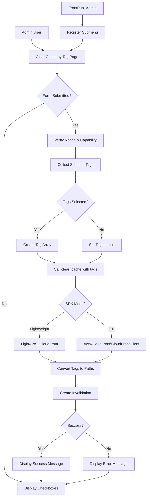

# Design Document: Clear Cache by Tag

## Overview

This design implements a "Clear Cache by Tag" admin page for the FrontPup WordPress plugin, enabling selective CloudFront cache invalidation based on cache tags. The implementation builds on the existing tag-based caching infrastructure (from the tag-based-caching spec) which sends `x-amz-meta-cache-tag` headers with post type values. This feature provides a WordPress admin interface for invalidating specific tagged content rather than clearing the entire cache.

### Feature Summary

- **Admin Page**: New submenu page "Clear Cache by Tag" under FrontPup menu
- **Two-Column Layout**: Public post types in left column, special tags in right column
- **Selective Invalidation**: Checkboxes allow selecting specific tags to invalidate
- **Full Cache Clear**: When no tags selected, entire cache is cleared (fallback behavior)
- **API Integration**: Modifies `FrontPup_Clear_Cache::clear_cache()` to accept `$tags` parameter
- **Dual SDK Support**: Works with both lightweight and full AWS SDK paths
- **Security**: Nonce verification, capability checks, input sanitization

### Design Goals

1. **Consistent Architecture**: Follow existing FrontPup admin patterns (extend `FrontPup_Admin_Base`)
2. **Minimal Intrusion**: Modify existing `clear_cache()` method with backward-compatible parameter
3. **User-Friendly**: Clear visual organization with two-column layout and helpful notice
4. **Secure**: Comprehensive input validation and WordPress security best practices
5. **Flexible**: Support both lightweight and full AWS SDK implementations

## Architecture

### Component Interaction



### Data Flow

1. **Admin Menu Registration**: `FrontPup_Admin::admin_menu()` → Add submenu page → Register view callback
2. **Page Display**: User navigates → `FrontPup_Admin_Clear_Cache_By_Tag::view()` → Render checkboxes
3. **Form Submission**: User submits → Verify nonce → Collect tags → Call `clear_cache($tags)`
4. **Tag Processing**: `clear_cache()` → Convert tags to paths → Create invalidation batch
5. **Feedback**: Success/error → `add_settings_error()` → Display message → Re-render page

### Integration Points

| Component | Integration Method | Purpose |
|-----------|-------------------|---------|
| `FrontPup_Admin` | Add new submenu page | Register "Clear Cache by Tag" page |
| `FrontPup_Admin_Clear_Cache_By_Tag` | New class extending `FrontPup_Admin_Base` | Controller for new admin page |
| `admin/views/clear-cache-by-tag-settings.php` | New view template | Render two-column checkbox layout |
| `FrontPup_Clear_Cache::clear_cache()` | Add `$tags` parameter | Accept tag array for selective invalidation |
| `LightAWS_CloudFront::createInvalidation()` | Modify to accept multiple paths | Support tag-based invalidation paths |

## Components and Interfaces

### 1. Admin Controller Component

**Class**: `FrontPup_Admin_Clear_Cache_By_Tag`

**File**: `admin/clear-cache-by-tag.class.php`

**Extends**: `FrontPup_Admin_Base`

**Responsibilities**:
- Display the Clear Cache by Tag admin page
- Handle form submission and tag collection
- Verify nonces and capability checks
- Call `clear_cache()` with selected tags
- Display success/error feedback

**Properties**:
```php
protected $settings_key = '';  // No settings stored for this page
protected $settings = [];
protected $settings_defaults = [];
protected $page_title = '';
protected $view = 'clear-cache-by-tag-settings';

// No validation fields needed (no settings saved)
protected $booleanFields = [];
protected $numericFields = [];
protected $stringFields = [];
```

**Methods**:
```php
/**
 * Override view() to handle form submission
 * Does not use WordPress Settings API (no settings to save)
 */
public function view(): void

/**
 * Process form submission
 * Collects tags, validates input, calls clear_cache()
 * 
 * @return void
 */
private function process_form_submission(): void

/**
 * Get all public post types
 * 
 * @return array Array of post type objects
 */
private function get_public_post_types(): array

/**
 * Get special tags
 * 
 * @return array Array of special tag values
 */
private function get_special_tags(): array
```

**Implementation Notes**:
- This admin page does NOT use the WordPress Settings API (no settings to save)
- Override `view()` method to handle form submission directly
- Use `check_admin_referer()` for nonce verification
- Use `current_user_can('manage_options')` for capability check
- Call `add_settings_error()` for feedback messages
- Re-render the page after processing (no redirect)

### 2. View Component

**File**: `admin/views/clear-cache-by-tag-settings.php`

**Template Variables**:
- `$this`: The `FrontPup_Admin_Clear_Cache_By_Tag` controller instance
- `$public_post_types`: Array of public post type objects
- `$special_tags`: Array of special tag strings

**Layout Structure**:
```html
<div class="wrap frontpup-settings">
  <h1>Clear Cache by Tag</h1>
  <?php settings_errors(); ?>
  
  <form method="post" action="">
    <?php wp_nonce_field('frontpup_clear_cache_by_tag_action', 'frontpup_clear_cache_by_tag_nonce'); ?>
    
    <div class="frontpup-two-column-layout">
      <div class="frontpup-column">
        <h2>Public Post Types</h2>
        <!-- Checkboxes for public post types -->
      </div>
      
      <div class="frontpup-column">
        <h2>Special Tags</h2>
        <!-- Checkboxes for special tags -->
      </div>
    </div>
    
    <p class="frontpup-notice">
      When no tags above are selected the entire cache will be cleared.
    </p>
    
    <?php submit_button('Submit'); ?>
  </form>
</div>
```

**CSS Styling**:
```css
.frontpup-two-column-layout {
  display: flex;
  gap: 40px;
  margin: 20px 0;
}

.frontpup-column {
  flex: 1;
}

.frontpup-column h2 {
  font-size: 1.1em;
  margin-bottom: 10px;
}

.frontpup-column label {
  display: block;
  margin-bottom: 8px;
}

.frontpup-notice {
  background: #f0f0f1;
  border-left: 4px solid #72aee6;
  padding: 12px;
  margin: 20px 0;
  font-style: italic;
}
```

### 3. Menu Integration Component

**Class**: `FrontPup_Admin`

**File**: `frontpup-admin.class.php`

**Modifications**:
```php
// In __construct(), add new admin view
$this->admin_views['clear-cache-by-tag'] = new FrontPup_Admin_Clear_Cache_By_Tag();

// In admin_menu(), add new submenu page
add_submenu_page(
    'frontpup-plugin',
    __('Clear Cache by Tag', 'frontpup'),
    __('Clear Cache by Tag', 'frontpup'),
    'manage_options',
    'frontpup-clear-cache-by-tag',
    [$this->admin_views['clear-cache-by-tag'], 'view']
);

// In admin_init(), set page title
$this->admin_views['clear-cache-by-tag']->set_page_title( __('Clear Cache by Tag', 'frontpup') );
```

### 4. Clear Cache Modification Component

**Class**: `FrontPup_Clear_Cache`

**File**: `clear-cache.class.php`

**Method Signature Change**:
```php
/**
 * Clear Cache method
 * 
 * @param array|null $tags Optional array of cache tags to invalidate.
 *                         If null or empty, clears entire cache (/*).
 *                         If array, converts to tag-based paths (tag:value/*).
 * @return bool True on success, false on failure
 */
public function clear_cache( ?array $tags = null ): bool
```

**Tag Processing Logic**:
```php
// Convert empty array to null
if ( is_array( $tags ) && empty( $tags ) ) {
    $tags = null;
}

// Build invalidation paths
if ( $tags === null ) {
    $paths = ['/*'];  // Clear entire cache
} else {
    $paths = [];
    foreach ( $tags as $tag ) {
        $paths[] = 'tag:' . $tag . '/*';
    }
}
```

**Lightweight SDK Path**:
```php
// Pass paths array directly to createInvalidation
$cf = new LightAWS_CloudFront_WP( $initOptions );
$this->result = $cf->createInvalidation( $this->settings['distribution_id'], $paths );
```

**Full AWS SDK Path**:
```php
// Pass paths array in InvalidationBatch structure
$client = new Aws\CloudFront\CloudFrontClient($initOptions);
$this->result = $client->createInvalidation([
    'DistributionId' => $this->settings['distribution_id'],
    'InvalidationBatch' => [
        'CallerReference' => (string) time(),
        'Paths' => [
            'Quantity' => count($paths),
            'Items' => $paths,
        ],
    ],
]);
```

### 5. Input Sanitization Component

**Implementation**: Within `FrontPup_Admin_Clear_Cache_By_Tag::process_form_submission()`

**Sanitization Rules**:
1. Use `sanitize_text_field()` on each checkbox value
2. Validate format: alphanumeric, hyphens, underscores only
3. Remove invalid tags from array
4. Limit to maximum 50 tags (CloudFront limit)
5. Display error if limit exceeded

**Validation Function**:
```php
/**
 * Validate and sanitize tag value
 * 
 * @param string $tag Raw tag value from form
 * @return string|false Sanitized tag or false if invalid
 */
private function validate_tag( string $tag ) {
    // Sanitize
    $tag = sanitize_text_field( $tag );
    
    // Validate format (alphanumeric, hyphens, underscores)
    if ( ! preg_match( '/^[a-z0-9\-_]+$/i', $tag ) ) {
        return false;
    }
    
    // Convert to lowercase for consistency
    $tag = strtolower( $tag );
    
    return $tag;
}
```

## Data Models

### Form Submission Data Model

**POST Data Structure**:
```php
[
    'frontpup_clear_cache_by_tag_nonce' => 'abc123...',  // Nonce value
    'frontpup_tags' => [                                  // Array of selected tags
        'post',
        'page',
        'home',
        'search'
    ]
]
```

**Checkbox Naming Convention**:
```html
<input type="checkbox" name="frontpup_tags[]" value="post" />
<input type="checkbox" name="frontpup_tags[]" value="page" />
<input type="checkbox" name="frontpup_tags[]" value="home" />
```

### Public Post Types Data Model

**Source**: `get_post_types( ['public' => true], 'objects' )`

**Structure**:
```php
[
    'post' => WP_Post_Type {
        name: 'post',
        label: 'Posts',
        labels: [...],
        public: true,
        ...
    },
    'page' => WP_Post_Type {
        name: 'page',
        label: 'Pages',
        ...
    },
    ...
]
```

**Display**: Use `$post_type->name` for checkbox value, `$post_type->label` for label text

### Special Tags Data Model

**Hardcoded Array**:
```php
[
    'error',
    'home',
    'search',
    'archive',
    'author',
    'unknown'
]
```

**Source**: Matches the special tags defined in `FrontPup::get_cache_tag()` method

### Invalidation Paths Data Model

**Format**: `tag:{tag_value}/*`

**Examples**:
```php
// Selected tags: ['post', 'page']
$paths = [
    'tag:post/*',
    'tag:page/*'
];

// No tags selected
$paths = ['/*'];

// Selected tags: ['home', 'search', 'archive']
$paths = [
    'tag:home/*',
    'tag:search/*',
    'tag:archive/*'
];
```

**CloudFront Requirements**:
- Maximum 3,000 paths per invalidation request
- Maximum 50 tags per object (we send 1 tag per object, so limit is 50 selected tags)
- Path format: Must start with `/`, can use `*` wildcard
- CallerReference: Unique string for idempotency (we use `time()`)

## Error Handling

### Error Scenarios

1. **No Distribution ID Configured**
   - **Detection**: `empty($this->settings['distribution_id'])`
   - **Handling**: Return false, set error message
   - **User Message**: "Distribution ID not set in settings"
   - **Impact**: Cannot proceed with invalidation

2. **Invalid Credentials**
   - **Detection**: AWS API returns authentication error
   - **Handling**: Catch exception, return false
   - **User Message**: "Error occurred while clearing CloudFront cache: {AWS error message}"
   - **Impact**: Invalidation fails

3. **Too Many Tags Selected**
   - **Detection**: `count($tags) > 50`
   - **Handling**: Display error, do not process
   - **User Message**: "Maximum 50 tags can be selected at once. Please reduce your selection."
   - **Impact**: Form not submitted

4. **Invalid Tag Format**
   - **Detection**: Tag contains invalid characters
   - **Handling**: Remove invalid tags, continue with valid ones
   - **User Message**: No explicit message (silently filtered)
   - **Impact**: Invalid tags ignored

5. **Nonce Verification Failure**
   - **Detection**: `check_admin_referer()` fails
   - **Handling**: WordPress displays error and dies
   - **User Message**: "Are you sure you want to do this?"
   - **Impact**: Form submission blocked

6. **Capability Check Failure**
   - **Detection**: `!current_user_can('manage_options')`
   - **Handling**: Display error, do not process
   - **User Message**: "You do not have sufficient permissions to access this page."
   - **Impact**: Page access denied

7. **CloudFront API Error**
   - **Detection**: Exception thrown by SDK
   - **Handling**: Catch exception, extract error message
   - **User Message**: "Error occurred while clearing CloudFront cache: {error details}"
   - **Impact**: Invalidation fails, user can retry

8. **Network Timeout**
   - **Detection**: HTTP request timeout
   - **Handling**: Exception caught, error message displayed
   - **User Message**: "Error occurred while clearing CloudFront cache: Connection timeout"
   - **Impact**: Invalidation may or may not have succeeded (check CloudFront console)

### Error Feedback Implementation

**Success Message**:
```php
add_settings_error(
    'frontpup_clear_cache_by_tag',
    'cache_cleared',
    __('Cache invalidation request completed successfully.', 'frontpup'),
    'updated'
);
```

**Error Message**:
```php
add_settings_error(
    'frontpup_clear_cache_by_tag',
    'cache_clear_failed',
    sprintf(
        __('Error occurred while clearing CloudFront cache: %s', 'frontpup'),
        $error_message
    ),
    'error'
);
```

**Display**:
```php
// In view template
settings_errors('frontpup_clear_cache_by_tag');
```

### Debugging Support

When `FRONTPUP_DEBUG` is defined and truthy:
- Log selected tags before processing
- Log converted invalidation paths
- Log API request/response details
- Add debug comments to HTML output

**Debug Output Example**:
```php
if ( defined('FRONTPUP_DEBUG') && FRONTPUP_DEBUG ) {
    error_log( 'FrontPup Clear Cache by Tag: Selected tags = ' . print_r($tags, true) );
    error_log( 'FrontPup Clear Cache by Tag: Invalidation paths = ' . print_r($paths, true) );
}
```

## Testing Strategy

### Unit Testing Approach

This feature is **NOT suitable for property-based testing** because:
1. **WordPress Integration**: Heavily dependent on WordPress admin infrastructure
2. **Side Effects**: Creates CloudFront invalidations (external API calls)
3. **UI Component**: Tests specific admin page rendering and form handling
4. **External Dependencies**: Relies on AWS CloudFront API

Instead, use **example-based unit tests** with WordPress test framework (WP_UnitTestCase) and **integration tests** for end-to-end validation.

### Unit Test Cases

#### Admin Page Tests

1. **Test: Page renders with public post types**
   - Setup: Register custom post type, navigate to page
   - Action: Render view
   - Assert: Checkboxes for 'post', 'page', and custom type are present

2. **Test: Page renders with special tags**
   - Setup: Navigate to page
   - Action: Render view
   - Assert: Checkboxes for 'error', 'home', 'search', 'archive', 'author', 'unknown' are present

3. **Test: Page requires manage_options capability**
   - Setup: Create user without manage_options
   - Action: Attempt to access page
   - Assert: Access denied message displayed

4. **Test: Nonce field is present in form**
   - Setup: Render page
   - Action: Check HTML output
   - Assert: Hidden nonce field exists with correct name

5. **Test: Notice text is displayed**
   - Setup: Render page
   - Action: Check HTML output
   - Assert: "When no tags above are selected the entire cache will be cleared." text is present

#### Form Submission Tests

6. **Test: Form submission with selected tags calls clear_cache with tags**
   - Setup: Mock clear_cache method, submit form with ['post', 'page']
   - Action: Process form
   - Assert: clear_cache called with ['post', 'page']

7. **Test: Form submission with no tags calls clear_cache with null**
   - Setup: Mock clear_cache method, submit form with no checkboxes
   - Action: Process form
   - Assert: clear_cache called with null

8. **Test: Form submission sanitizes tag values**
   - Setup: Submit form with tag containing special characters
   - Action: Process form
   - Assert: Invalid characters removed from tag

9. **Test: Form submission rejects more than 50 tags**
   - Setup: Submit form with 51 tags
   - Action: Process form
   - Assert: Error message displayed, clear_cache not called

10. **Test: Form submission verifies nonce**
    - Setup: Submit form with invalid nonce
    - Action: Process form
    - Assert: WordPress nonce error displayed

11. **Test: Success message displayed on successful invalidation**
    - Setup: Mock clear_cache to return true
    - Action: Submit form
    - Assert: Success message displayed via settings_errors

12. **Test: Error message displayed on failed invalidation**
    - Setup: Mock clear_cache to return false with error
    - Action: Submit form
    - Assert: Error message displayed with details

#### Clear Cache Method Tests

13. **Test: clear_cache with null creates /* path**
    - Setup: Call clear_cache(null)
    - Action: Check invalidation paths
    - Assert: Paths array is ['/*']

14. **Test: clear_cache with empty array creates /* path**
    - Setup: Call clear_cache([])
    - Action: Check invalidation paths
    - Assert: Paths array is ['/*']

15. **Test: clear_cache with tags creates tag-based paths**
    - Setup: Call clear_cache(['post', 'page'])
    - Action: Check invalidation paths
    - Assert: Paths array is ['tag:post/*', 'tag:page/*']

16. **Test: clear_cache with single tag creates single path**
    - Setup: Call clear_cache(['home'])
    - Action: Check invalidation paths
    - Assert: Paths array is ['tag:home/*']

17. **Test: clear_cache maintains backward compatibility**
    - Setup: Call clear_cache() with no parameters
    - Action: Check invalidation paths
    - Assert: Paths array is ['/*']

#### Lightweight SDK Tests

18. **Test: Lightweight SDK receives multiple paths**
    - Setup: Mock LightAWS_CloudFront, call clear_cache(['post', 'page'])
    - Action: Check createInvalidation call
    - Assert: Paths parameter is ['tag:post/*', 'tag:page/*']

19. **Test: Lightweight SDK receives single /* path**
    - Setup: Mock LightAWS_CloudFront, call clear_cache(null)
    - Action: Check createInvalidation call
    - Assert: Paths parameter is ['/*']

#### Full AWS SDK Tests

20. **Test: Full SDK receives multiple paths in Items**
    - Setup: Enable full_aws_sdk, mock CloudFrontClient, call clear_cache(['post', 'page'])
    - Action: Check createInvalidation call
    - Assert: InvalidationBatch['Paths']['Items'] is ['tag:post/*', 'tag:page/*']

21. **Test: Full SDK Quantity matches path count**
    - Setup: Enable full_aws_sdk, mock CloudFrontClient, call clear_cache(['post', 'page', 'home'])
    - Action: Check createInvalidation call
    - Assert: InvalidationBatch['Paths']['Quantity'] is 3

#### Input Validation Tests

22. **Test: Alphanumeric tags are valid**
    - Input: 'post123'
    - Expected: 'post123'

23. **Test: Tags with hyphens are valid**
    - Input: 'custom-post-type'
    - Expected: 'custom-post-type'

24. **Test: Tags with underscores are valid**
    - Input: 'custom_post_type'
    - Expected: 'custom_post_type'

25. **Test: Tags with spaces are invalid**
    - Input: 'my post'
    - Expected: Rejected (not included in tags array)

26. **Test: Tags with special characters are invalid**
    - Input: 'post!@#'
    - Expected: Rejected (not included in tags array)

27. **Test: Mixed case tags are normalized to lowercase**
    - Input: 'POST'
    - Expected: 'post'

### Integration Testing

28. **Test: End-to-end tag-based invalidation**
    - Setup: Configure credentials, enable tag-based caching
    - Action: Submit form with ['post', 'page'], check CloudFront console
    - Assert: Invalidation created with correct paths

29. **Test: End-to-end full cache clear**
    - Setup: Configure credentials
    - Action: Submit form with no tags, check CloudFront console
    - Assert: Invalidation created with /* path

30. **Test: Menu integration**
    - Setup: Log in as admin
    - Action: Navigate to FrontPup menu
    - Assert: "Clear Cache by Tag" submenu item is visible

### Manual Testing Checklist

- [ ] Admin page appears in FrontPup submenu
- [ ] Page displays all public post types with checkboxes
- [ ] Page displays all special tags with checkboxes
- [ ] Two-column layout renders correctly
- [ ] Notice text is visible and styled correctly
- [ ] Submit button is present
- [ ] Selecting tags and submitting creates tag-based invalidation
- [ ] Submitting with no tags creates /* invalidation
- [ ] Success message displays after successful invalidation
- [ ] Error message displays after failed invalidation
- [ ] Page state is preserved after submission (no redirect)
- [ ] Checkboxes reset to unchecked after submission
- [ ] Nonce verification prevents CSRF attacks
- [ ] Non-admin users cannot access page
- [ ] Works with lightweight SDK
- [ ] Works with full AWS SDK
- [ ] Works with all three credential modes (policy, wpconfig, database)

### Test Environment Requirements

- WordPress 6.0+
- PHP 8.1+
- WordPress test framework (WP_UnitTestCase)
- AWS CloudFront distribution with tag-based caching enabled
- Ability to mock AWS SDK classes
- Ability to register custom post types for testing

## Implementation Notes

### Code Location

- **Admin controller**: `admin/clear-cache-by-tag.class.php` (new file)
- **View template**: `admin/views/clear-cache-by-tag-settings.php` (new file)
- **Admin bootstrap**: `frontpup-admin.class.php` (modify existing)
- **Clear cache logic**: `clear-cache.class.php` (modify existing)

### WordPress Coding Standards

- Use `snake_case` for method names: `process_form_submission()`, `get_public_post_types()`
- Use `PascalCase` for class names: `FrontPup_Admin_Clear_Cache_By_Tag`
- Escape all output in views: `esc_attr()`, `esc_html()`, `checked()`
- Use `__()` for translatable strings with 'frontpup' text domain
- Use `wp_nonce_field()` and `check_admin_referer()` for nonce handling
- Use `current_user_can('manage_options')` for capability checks
- Use `add_settings_error()` and `settings_errors()` for feedback messages

### Performance Considerations

- **Minimal Overhead**: Post type retrieval uses existing WordPress functions (no additional queries)
- **No Database Writes**: This page does not save settings (no option updates)
- **Efficient Rendering**: Simple checkbox list, no complex JavaScript
- **API Efficiency**: Single invalidation request regardless of tag count

### Security Considerations

- **Nonce Verification**: Prevents CSRF attacks on form submission
- **Capability Check**: Requires `manage_options` capability (admin-only)
- **Input Sanitization**: All tag values sanitized with `sanitize_text_field()`
- **Format Validation**: Regex validation ensures only safe characters
- **Tag Limit**: Maximum 50 tags prevents abuse and CloudFront errors
- **No User Input in Paths**: Tags come from predefined post types and special tags

### Backward Compatibility

- **Default Parameter**: `clear_cache($tags = null)` maintains backward compatibility
- **Existing Functionality**: All existing clear cache actions continue to work
- **No Breaking Changes**: Existing code calling `clear_cache()` without parameters works unchanged
- **Admin Bar Action**: Existing admin bar "Clear CloudFront Cache" continues to clear entire cache
- **Settings Page**: Existing "Test credentials, clear cache upon saving" continues to work

### Future Enhancements

1. **Bulk Actions**: Add "Select All" / "Deselect All" buttons for each column
2. **Tag Search**: Add search/filter functionality for large post type lists
3. **Recent Invalidations**: Display list of recent invalidations with status
4. **Invalidation History**: Store and display history of tag-based invalidations
5. **Custom Tags**: Allow users to define custom tag patterns beyond post types
6. **AJAX Submission**: Submit form via AJAX to avoid page reload
7. **Progress Indicator**: Show loading spinner during invalidation request
8. **Taxonomy Tags**: Include category/tag names in cache tags for finer granularity

## References

- [CloudFront Tag-Based Invalidation Documentation](https://docs.aws.amazon.com/AmazonCloudFront/latest/DeveloperGuide/invalidation-by-tags.html) (AWS official documentation, public domain)
- [WordPress Settings API](https://developer.wordpress.org/plugins/settings/settings-api/)
- [WordPress Admin Menus](https://developer.wordpress.org/plugins/administration-menus/)
- [WordPress Nonces](https://developer.wordpress.org/plugins/security/nonces/)
- [WordPress Capabilities](https://wordpress.org/documentation/article/roles-and-capabilities/)

---

**Content was rephrased for compliance with licensing restrictions**
