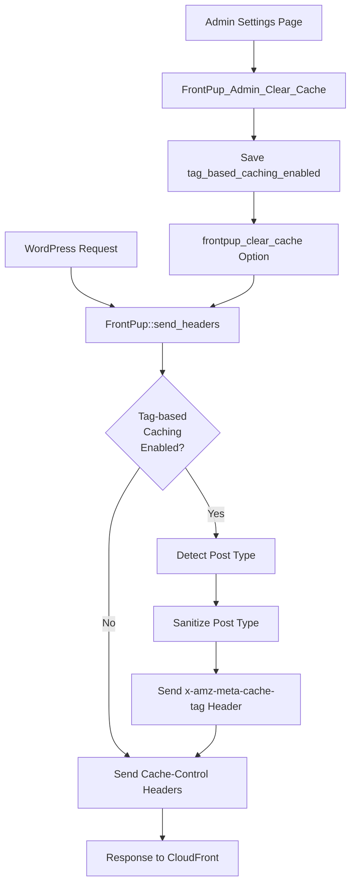

# Design Document: Tag-Based Caching

## Overview

This design implements tag-based caching for the FrontPup WordPress plugin, enabling CloudFront's tag-based invalidation feature. The implementation adds a new setting to the Clear Cache Settings page and modifies the `send_headers` filter to include the `x-amz-meta-cache-tag` HTTP response header with WordPress post type values.

### Feature Summary

- **Setting**: Boolean checkbox "Tag-based Caching" in Clear Cache Settings page
- **Header**: `x-amz-meta-cache-tag` sent with post type values (e.g., "post", "page", "home", "archive")
- **Detection**: Automatic post type detection using WordPress query functions
- **Sanitization**: Header values sanitized to meet CloudFront requirements (lowercase, alphanumeric/hyphens/underscores, 256 char max)
- **Compatibility**: Works alongside existing cache control and invalidation features

### Design Goals

1. **Minimal Intrusion**: Leverage existing `send_headers` filter and settings infrastructure
2. **WordPress Native**: Use WordPress query functions for post type detection
3. **CloudFront Compliant**: Follow AWS documentation for header format and tag values
4. **Backward Compatible**: No impact on existing functionality when disabled
5. **Extensible**: Design allows future enhancement for multiple tags or custom tag strategies

## Architecture

### Component Interaction



### Data Flow

1. **Settings Storage**: Admin saves checkbox → WordPress Settings API → `frontpup_clear_cache` option
2. **Header Injection**: Request arrives → `send_headers` filter → Check setting → Detect post type → Sanitize → Send header
3. **CloudFront Processing**: CloudFront receives response → Extracts `x-amz-meta-cache-tag` → Associates tag with cached object

### Integration Points

| Component | Integration Method | Purpose |
|-----------|-------------------|---------|
| `FrontPup::send_headers()` | Modify existing filter | Add cache tag header logic |
| `FrontPup_Admin_Clear_Cache` | Extend settings arrays | Add new boolean field |
| `admin/views/clear-cache-settings.php` | Add HTML checkbox | UI for enabling feature |
| `frontpup_clear_cache` option | Add new key | Persist setting |

## Components and Interfaces

### 1. Settings Component

**Class**: `FrontPup_Admin_Clear_Cache`

**Modifications**:
```php
// Add to $settings_defaults
'tag_based_caching_enabled' => 0,

// Add to $booleanFields
'tag_based_caching_enabled'
```

**Interface**: Extends existing WordPress Settings API pattern

### 2. View Component

**File**: `admin/views/clear-cache-settings.php`

**Addition**: HTML checkbox after "Enable Clear Cache" option

**Template Variables**:
- `$this->settings_key`: 'frontpup_clear_cache'
- `$settings['tag_based_caching_enabled']`: Boolean value

### 3. Header Injection Component

**Class**: `FrontPup`

**Method**: `send_headers()` (existing, to be modified)

**New Private Method**: `get_cache_tag(): string`

**Responsibilities**:
- Check if tag-based caching is enabled
- Detect current post type
- Sanitize tag value
- Send `x-amz-meta-cache-tag` header

**Interface**:
```php
/**
 * Get cache tag for current request
 * 
 * @return string Cache tag value (sanitized post type or special value)
 */
private function get_cache_tag(): string
```

### 4. Post Type Detection Component

**Implementation**: Within `FrontPup::get_cache_tag()`

**Detection Strategy**:
```php
// Priority order:
1. Check for 404 or error → return empty string (no header)
2. Check is_home() → return 'home'
3. Check is_search() → return 'search'
4. Check is_singular() → get_post_type() from queried object
5. Check is_post_type_archive() → get_query_var('post_type')
6. Check is_category() || is_tag() || is_tax() → return 'archive'
7. Check is_author() → return 'author'
8. Default → return 'unknown'
```

### 5. Sanitization Component

**Implementation**: Within `FrontPup::get_cache_tag()`

**Sanitization Rules** (per CloudFront documentation):
- Convert to lowercase
- Remove characters not in: `a-z`, `0-9`, `-`, `_`
- Truncate to 256 characters maximum
- If result is empty string, return 'unknown'

**Function**:
```php
/**
 * Sanitize cache tag value for CloudFront
 * 
 * @param string $tag Raw tag value
 * @return string Sanitized tag value
 */
private function sanitize_cache_tag( string $tag ): string {
    // Convert to lowercase
    $tag = strtolower( $tag );
    
    // Remove invalid characters (keep alphanumeric, hyphens, underscores)
    $tag = preg_replace( '/[^a-z0-9\-_]/', '', $tag );
    
    // Truncate to 256 characters
    $tag = substr( $tag, 0, 256 );
    
    // Return 'unknown' if empty after sanitization
    return empty( $tag ) ? 'unknown' : $tag;
}
```

## Data Models

### Settings Data Model

**Option Key**: `frontpup_clear_cache`

**New Field**:
```php
[
    'tag_based_caching_enabled' => 0,  // int (0 or 1)
    // ... existing fields ...
]
```

**Type**: Boolean (stored as integer 0 or 1)

**Default**: 0 (disabled)

**Validation**: Sanitized via `FrontPup_Admin_Base::sanitize_settings()` using `$booleanFields` array

### HTTP Header Model

**Header Name**: `x-amz-meta-cache-tag`

**Header Value Format**: Single tag string (not comma-separated for this implementation)

**Example Values**:
- `post` - Single blog post
- `page` - Static page
- `product` - Custom post type
- `home` - Homepage
- `search` - Search results
- `archive` - Category/tag/taxonomy archive
- `author` - Author archive
- `unknown` - Fallback when post type cannot be determined

**CloudFront Requirements**:
- ASCII visible characters (33-126)
- No control characters, spaces, or commas
- Case-insensitive (we use lowercase)
- Maximum 256 characters per tag
- Maximum 50 tags per object (we send only 1 tag)

### Post Type Mapping

| WordPress Context | Detection Method | Cache Tag Value |
|-------------------|------------------|-----------------|
| Single post/page/CPT | `is_singular()` + `get_post_type()` | Post type slug |
| Post type archive | `is_post_type_archive()` + `get_query_var('post_type')` | Post type slug |
| Homepage | `is_home()` | `home` |
| Search results | `is_search()` | `search` |
| Category/tag/taxonomy | `is_category()` \|\| `is_tag()` \|\| `is_tax()` | `archive` |
| Author archive | `is_author()` | `author` |
| 404 error | `is_404()` | _(no header sent)_ |
| WordPress error | `is_wp_error()` | _(no header sent)_ |
| Unknown | Default fallback | `unknown` |

## Error Handling

### Error Scenarios

1. **Headers Already Sent**
   - **Detection**: `headers_sent()` returns true
   - **Handling**: Return early, do not attempt to send header
   - **Impact**: No cache tag header sent (graceful degradation)

2. **Post Type Detection Failure**
   - **Detection**: All detection methods return false/null
   - **Handling**: Use 'unknown' as fallback tag value
   - **Impact**: Content still cached with generic tag

3. **Invalid Post Type Characters**
   - **Detection**: Post type contains non-alphanumeric characters
   - **Handling**: Sanitize via `sanitize_cache_tag()` method
   - **Impact**: Invalid characters removed, valid portion used

4. **Empty Post Type After Sanitization**
   - **Detection**: Sanitized string is empty
   - **Handling**: Return 'unknown' as fallback
   - **Impact**: Content cached with generic tag

5. **404 or Error Pages**
   - **Detection**: `is_404()` or `is_wp_error()` returns true
   - **Handling**: Do not send cache tag header
   - **Impact**: Error pages not tagged (consistent with existing behavior)

6. **Logged-in Users**
   - **Detection**: `LOGGED_IN_COOKIE` is set
   - **Handling**: Send cache tag header before sending no-cache headers
   - **Impact**: Tag sent but content not cached (per requirement 6.3)

### Error Logging

No explicit error logging is implemented for this feature. The plugin follows WordPress conventions:
- Silent failures for non-critical operations
- Graceful degradation when headers cannot be sent
- No user-facing error messages for header injection failures

### Debugging Support

When `FRONTPUP_DEBUG` is defined and truthy:
- Existing `X-Front-Pup` debug headers continue to work
- Consider adding `X-Front-Pup-Cache-Tag` debug header showing detected post type

## Testing Strategy

### Unit Testing Approach

This feature is **NOT suitable for property-based testing** because:
1. **WordPress Integration**: Heavily dependent on WordPress global state (`$wp_query`, conditional tags)
2. **Side Effects**: Sends HTTP headers (side-effect-only operation)
3. **External Dependencies**: Relies on WordPress functions that cannot be easily mocked
4. **Configuration Validation**: Tests specific WordPress post type configurations, not universal properties

Instead, use **example-based unit tests** with WordPress test framework (WP_UnitTestCase).

### Unit Test Cases

#### Settings Tests

1. **Test: Checkbox renders when setting is enabled**
   - Setup: Set `tag_based_caching_enabled` to 1
   - Action: Render settings view
   - Assert: Checkbox is checked

2. **Test: Checkbox renders when setting is disabled**
   - Setup: Set `tag_based_caching_enabled` to 0
   - Action: Render settings view
   - Assert: Checkbox is unchecked

3. **Test: Setting saves correctly when checked**
   - Setup: POST data with checkbox checked
   - Action: Call `sanitize_settings()`
   - Assert: `tag_based_caching_enabled` is 1

4. **Test: Setting saves correctly when unchecked**
   - Setup: POST data without checkbox
   - Action: Call `sanitize_settings()`
   - Assert: `tag_based_caching_enabled` is 0

5. **Test: Default value is disabled**
   - Setup: Fresh install (no saved settings)
   - Action: Load settings
   - Assert: `tag_based_caching_enabled` is 0

#### Header Injection Tests

6. **Test: Header sent for single post when enabled**
   - Setup: Enable setting, create post, query single post
   - Action: Call `send_headers()`
   - Assert: `x-amz-meta-cache-tag: post` header sent

7. **Test: Header sent for page when enabled**
   - Setup: Enable setting, create page, query single page
   - Action: Call `send_headers()`
   - Assert: `x-amz-meta-cache-tag: page` header sent

8. **Test: Header sent for custom post type when enabled**
   - Setup: Enable setting, register 'product' CPT, create product, query single product
   - Action: Call `send_headers()`
   - Assert: `x-amz-meta-cache-tag: product` header sent

9. **Test: Header NOT sent when disabled**
   - Setup: Disable setting, create post, query single post
   - Action: Call `send_headers()`
   - Assert: `x-amz-meta-cache-tag` header NOT sent

10. **Test: Header sent for homepage**
    - Setup: Enable setting, query homepage
    - Action: Call `send_headers()`
    - Assert: `x-amz-meta-cache-tag: home` header sent

11. **Test: Header sent for search results**
    - Setup: Enable setting, query search results
    - Action: Call `send_headers()`
    - Assert: `x-amz-meta-cache-tag: search` header sent

12. **Test: Header sent for category archive**
    - Setup: Enable setting, query category archive
    - Action: Call `send_headers()`
    - Assert: `x-amz-meta-cache-tag: archive` header sent

13. **Test: Header sent for author archive**
    - Setup: Enable setting, query author archive
    - Action: Call `send_headers()`
    - Assert: `x-amz-meta-cache-tag: author` header sent

14. **Test: Header NOT sent for 404 page**
    - Setup: Enable setting, query 404 page
    - Action: Call `send_headers()`
    - Assert: `x-amz-meta-cache-tag` header NOT sent

15. **Test: Header sent before no-cache headers for logged-in users**
    - Setup: Enable setting, set logged-in cookie, create post, query single post
    - Action: Call `send_headers()`
    - Assert: `x-amz-meta-cache-tag: post` header sent before `Cache-Control: no-cache`

#### Sanitization Tests

16. **Test: Uppercase post type converted to lowercase**
    - Input: 'POST'
    - Expected: 'post'

17. **Test: Post type with spaces sanitized**
    - Input: 'my post type'
    - Expected: 'myposttype'

18. **Test: Post type with special characters sanitized**
    - Input: 'my-post_type!@#'
    - Expected: 'my-post_type'

19. **Test: Post type exceeding 256 characters truncated**
    - Input: String of 300 'a' characters
    - Expected: String of 256 'a' characters

20. **Test: Empty post type returns 'unknown'**
    - Input: ''
    - Expected: 'unknown'

21. **Test: Post type with only invalid characters returns 'unknown'**
    - Input: '!@#$%^&*()'
    - Expected: 'unknown'

#### Edge Case Tests

22. **Test: Headers already sent**
    - Setup: Call `headers_sent()` mock to return true
    - Action: Call `send_headers()`
    - Assert: No error thrown, function returns early

23. **Test: Post type detection returns null**
    - Setup: Mock all detection methods to return false/null
    - Action: Call `get_cache_tag()`
    - Assert: Returns 'unknown'

24. **Test: Cache-Control headers still sent when tag-based caching enabled**
    - Setup: Enable tag-based caching, enable cache control
    - Action: Call `send_headers()`
    - Assert: Both `x-amz-meta-cache-tag` and `Cache-Control` headers sent

### Integration Testing

25. **Test: End-to-end WordPress request with tag-based caching**
    - Setup: Enable setting, create post
    - Action: Make HTTP request to post URL
    - Assert: Response includes `x-amz-meta-cache-tag: post` header

26. **Test: Settings page save and reload**
    - Setup: Navigate to Clear Cache Settings page
    - Action: Check "Tag-based Caching", save, reload page
    - Assert: Checkbox remains checked

### Manual Testing Checklist

- [ ] Checkbox appears in Clear Cache Settings page
- [ ] Checkbox state persists after save
- [ ] Header appears in HTTP response when enabled (use browser dev tools)
- [ ] Header does NOT appear when disabled
- [ ] Different post types produce different tag values
- [ ] Special characters in custom post types are sanitized
- [ ] 404 pages do not include cache tag header
- [ ] Logged-in users receive cache tag header before no-cache headers
- [ ] Existing cache control functionality continues to work

### Test Environment Requirements

- WordPress 6.0+
- PHP 8.1+
- WordPress test framework (WP_UnitTestCase)
- Ability to mock `headers_sent()` and `header()` functions
- Ability to set up custom post types for testing

## Implementation Notes

### Code Location

- **Settings class**: `admin/clear-cache.class.php` (modify existing)
- **View template**: `admin/views/clear-cache-settings.php` (modify existing)
- **Core logic**: `frontpup.class.php` (modify `send_headers()` method, add helper methods)

### WordPress Coding Standards

- Use `snake_case` for method names: `get_cache_tag()`, `sanitize_cache_tag()`
- Use `PascalCase` for class names (existing classes)
- Escape all output in views: `esc_attr()`, `esc_html()`, `checked()`
- Use `__()` for translatable strings with 'frontpup' text domain
- Follow WordPress conditional tag patterns: `is_singular()`, `is_home()`, etc.

### Performance Considerations

- **Minimal Overhead**: Post type detection uses existing WordPress query object (no additional database queries)
- **Early Returns**: Check if feature is enabled before any processing
- **No External Calls**: All logic is in-memory PHP operations
- **Header Timing**: Headers sent during existing `send_headers` filter (no additional hook)

### Security Considerations

- **Input Sanitization**: All post type values sanitized before use in headers
- **No User Input**: Post types come from WordPress core, not user input
- **Header Injection Prevention**: Sanitization removes characters that could cause header injection
- **Capability Check**: Settings page requires `manage_options` capability (existing)

### Backward Compatibility

- **Default Disabled**: Feature is opt-in, no impact on existing installations
- **No Breaking Changes**: Existing functionality unchanged when feature is disabled
- **Settings Migration**: No migration needed, new field has safe default value
- **CloudFront Compatibility**: CloudFront ignores unknown headers, safe for distributions without tag-based invalidation configured

### Future Enhancements

1. **Multiple Tags**: Support comma-separated tags (e.g., "post,category:news")
2. **Custom Tag Strategies**: Allow users to define custom tag patterns
3. **Taxonomy Tags**: Include category/tag names in cache tags
4. **Tag-Based Invalidation UI**: Add UI for invalidating by tag (requires CloudFront API enhancement)
5. **Tag Preview**: Show detected tag in admin bar for debugging

## References

- [CloudFront Tag-Based Invalidation Documentation](https://docs.aws.amazon.com/AmazonCloudFront/latest/DeveloperGuide/invalidation-by-tags.html) (AWS official documentation, public domain)
- [WordPress Conditional Tags](https://developer.wordpress.org/themes/basics/conditional-tags/)
- [WordPress Post Types](https://developer.wordpress.org/plugins/post-types/)
- [HTTP Header Injection Prevention](https://owasp.org/www-community/attacks/HTTP_Response_Splitting)

---

**Content was rephrased for compliance with licensing restrictions**
